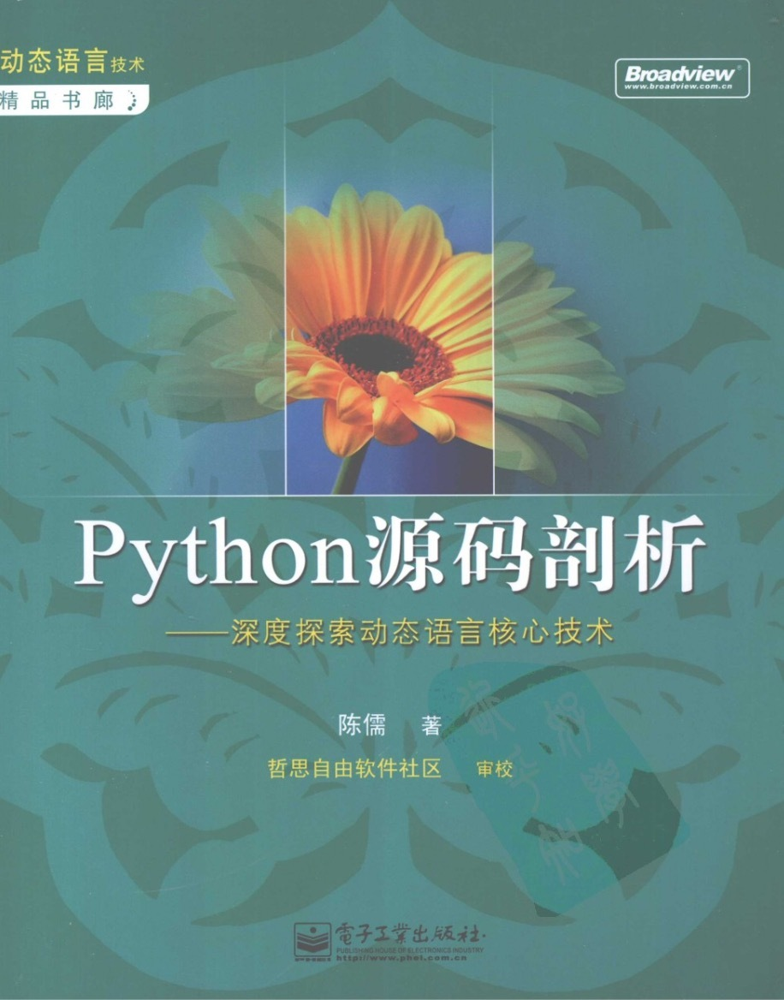

# Python源码剖析：深度探索动态语言核心技术

> 前一阵终于把电子书（本仓库的pdf）、配套资源（本仓库的word）、配套代码（本仓库文件夹）找齐了！
> 
> 虽然其Python版本已经很旧了，但不影响它为一本好书！与大家分享！

## Introduction

作为主流的动态语言，Python不仅简单易学、移植性好，而且拥有强大丰富的库的支持。此外，Python强大的可扩展性，让开发人员既可以非常容易地利用C/C++编写Python的扩展模块，还能将Python嵌入到C/C++程序中，为自己的系统添加动态扩展和动态编程的能力。

为了更好地利用Python语言，无论是使用Python语言本身，还是将Python与C/C++交互使用，深刻理解Python的运行原理都是非常重要的。本书以CPython为研究对象，在C代码一级，深入细致地剖析了Python的实现。书中不仅包括了对大量Python内置对象的剖析，更将大量的篇幅用于对Python虚拟机及Python高级特性的剖析。通过此书，读者能够透彻地理解Python中的一般表达式、控制结构、异常机制、类机制、多线程机制、模块的动态加载机制、内存管理机制等核心技术的运行原理，同时，本书所揭示的动态语言的核心技术对于理解其他动态语言，如 Javascript、Ruby等也有较大的参考价值。

本书适合于Python程序员、动态语言爱好者、C程序员阅读。

## Resources

- [作者的 CSDN 博客](https://blog.csdn.net/balabalamerobert)
  - 可惜不再更新了

- [Extending and Embedding the Python Interpreter](https://docs.python.org/3/extending/index.html)
  - 扩展和嵌入 Python 解析器，介绍了如何用 C/C++ 编写 Python 的扩展模块，如何在其它语言中嵌入 Python 解释器

- [Python/C API Reference Manual](https://docs.python.org/3/c-api/index.html)
  - 详细介绍了 Python 内部的 C API

- [Python Developer’s Guide](https://devguide.python.org/)
  - Python 开发者指南

- [有没有内容类似于《Python源码剖析》，但内容更新过，针对新版本的Python书籍 - 知乎](https://www.zhihu.com/question/40787248)
  - 该书出版年份2008年，基于Python2.5，最新的相关内容见这个链接

- [CPython-Internals - GitHub](https://github.com/zpoint/CPython-Internals)
  - This repository is some notes/blog for cpython source code. Trying to illustrate every detail of cpython implementation

## Chinese Version

## Table of Contents

* 第0章 Python源码剖析——编译Python
    * 0.1 Python总体架构
    * 0.2 Python源代码的组织
    * 0.3 Windows环境下编译Python
    * 0.4 Unix/Linux环境下编译Python
    * 0.5 修改Python源代码
    * 0.6 通往Python之路
    * 0.7 一些注意事项
> 第1部分 Python内建对象
* 第1章 Python对象初探
    * 1.1 Python内的对象
    * 1.2 类型对象
    * 1.3 Python对象的多态性
    * 1.4 引用计数
    * 1.5 Python对象的分类
* 第2章 Python中的整数对象
    * 2.1 初识PyIntObject对象
    * 2.2 PyIntObject对象的创建和维护
    * 2.3 Hack PyIntObject
* 第3章 Python中的字符串对象
    * 3.1 PyStringObject与PyString_Type
    * 3.2 创建PyStringObject对象
    * 3.3 字符串对象的intern机制
    * 3.4 字符缓冲池
    * 3.5 PyStringObject效率相关问题
    * 3.6 Hack PyStringObject
* 第4章 Python中的List对象
    * 4.1 PyListObject对象
    * 4.2 PyListObject对象的创建与维护
    * 4.3 PyListObject对象缓冲池
    * 4.4 Hack PyListObject
* 第5章 Python中的Dict对象
    * 5.1 散列表概述
    * 5.2 PyDictObject
    * 5.3 PyDictObject的创建和维护
    * 5.4 PyDictObject对象缓冲池
    * 5.5 Hack PyDictObject
* 第6章 最简单的Python模拟——Small Python
* 6.1 Small Python
* 6.2 对象机制
* 6.3 解释过程
* 6.4 交互式环境
> 第2部分 Python虚拟机
* 第7章 Python的编译结果——Code对象与pyc文件
    * 7.1 Python程序的执行过程
    * 7.2 Python编译器的编译结果——PyCodeObject对象
    * 7.3 Pyc文件的生成
    * 7.4 Python的字节码
    * 7.5 解析pyc文件
* 第8章 Python虚拟机框架
    * 8.1 Python虚拟机中的执行环境
    * 8.2 名字、作用域和名字空间
    * 8.3 Python虚拟机的运行框架
    * 8.4 Python运行时环境初探
* 第9章 Python虚拟机中的一般表达式
    * 9.1 简单内建对象的创建
    * 9.2 复杂内建对象的创建
    * 9.3 其他一般表达式
* 第10章 Python虚拟机中的控制流
    * 10.1 Python虚拟机中的if控制流
    * 10.2 Python虚拟机中的for循环控制流
    * 10.3 Python虚拟机中的while循环控制结构
    * 10.4 Python虚拟机中的异常控制流
* 第11章 Python虚拟机中的函数机制
    * 11.1 PyFunctionObject对象
    * 11.2 无参函数调用
    * 11.3 函数执行时的名字空间
    * 11.4 函数参数的实现
    * 11.5 函数中局部变量的访问
    * 11.6 嵌套函数、闭包与decorator
* 第12章 Python虚拟机中的类机制
    * 12.1 Python中的对象模型
    * 12.2 从type对象到class对象
    * 12.3 用户自定义class
    * 12.4 从class对象到instance对象
    * 12.5 访问instance对象中的属性
    * 12.6 千变万化的descriptor
> 第3部分 Python 高级话题  
* 第13章 Python运行环境初始化
    * 13.1 线程环境初始化
    * 13.2 系统module初始化
    * 13.3 激活Python虚拟机
* 第14章 Python模块的动态加载机制
    * 14.1 import前奏曲
    * 14.2 Python中import机制的黑盒探测
    * 14.3 import机制的实现
    * 14.4 Python中的import操作
    * 14.5 与module有关的名字空间问题
* 第15章 Python多线程机制
    * 15.1 GIL与线程调度
    * 15.2 初见Python Thread
    * 15.3 Python线程的创建
    * 15.4 Python线程的调度
    * 15.5 Python子线程的销毁
    * 15.6 Python线程的用户级互斥与同步
    * 15.7 高级线程库——threading
* 第16章 Python的内存管理机制
    * 16.1 内存管理架构
    * 16.2 小块空间的内存池
    * 16.3 循环引用的垃圾收集
    * 16.4 Python中的垃圾收集

